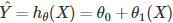
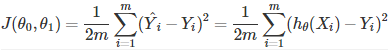

# 機械学習とは
もともとの定義は「明示的なプログラミングをせずに、コンピュータに学習能力をもたせる学問」。大きく分けて2つに分類できる。

## 教師あり学習(Supervised Learning)
あるデータにおいて、インプットとアウトプットの関係が明らかな場合、その課題は教師あり学習と呼ばれる。

教師あり学習は **回帰分析(regression)** と **分類(classification)** に分かれる。

### 回帰分析(regression)
インプットX[1]...X[n]とアウトプットY[1]...Y[n]の関係がわかっているデータを用いて、新しいインプットX[a]からアウトプットY[a]の具体的な数値を予測する課題のこと。

> 人の写真を見て、その人の年齢を予測

### 分類(classification)
インプットX[1]...X[n]とアウトプットY[1]...Y[n]の関係がわかっているデータを用いて、新しいインプットX[a]からアウトプットY[a]のカテゴリーを予測する課題のこと。

> 人の写真をみて恋人がいるかどうかの予測

## 教師なし学習(Unsupervised Learning)
データに含まれる変数同士の関係を仮定せず、そのデータの構造を決定するとき、その課題は教師なし学習と呼ばれる。教師なし学習の代表例はクラスタリング(clustering)

### クラスタリング(clustering)
データ内の変数に基づき、データを複数の小さなグループに仕分けする

> 男性の新入社員500人の履歴書を、そこにある変数(先行、学歴、職歴、趣味など)から、自動的に似た者同士のグループに仕分ける

# 単解析分析(Linear Regression with One Variable)
過去の試験の結果から次の試験の結果を予測することを試みた場合、**得点** という数値を予測するので教師あり学習の回帰分析を使う。ここでは **単回帰分析** という **一つのアウトプット(得点)を一つのインプット(テスト番号)から予測** する方法を取る。

## 仮定関数(Hypothesis function)
テスト番号をX、得点をYとすると、単回帰分析では、YはXによって以下のような一次関数の式で説明される。

これが答えとなる予測式の鋳型。この関数の自由パラメータtheta_0,theta_1をいじり、データに最も誤差なくフィットする式をつくる。

## 目的関数(cost function)
仮定関数がどの程度誤差なくデータにフィットしているかを計算するため、目的関数(cost function)を導入する。

この式の実際は、**予測値Yが実測値Xとどれぐらいずれているのか**、すべてのデータポイント(今回はm=4)で差の事情を計算し、足し合わせて平均をとっているだけ。2で割られているのは、後々この関数J(θ[0],θ[1])を微分するときにちょっと計算しやすくするため。

もしJ(θ[0],θ[1])=0となるようなθ[0],θ[1]を見つけられたなら、仮定関数h[θ](X)は誤差なく、すべてのデータポイントを完全に通ることになる。

## 最急降下法(Gradient Descent)
仮定関数h[θ](X)と、そのパフォーマンスを定量する目的関数J(θ[0],θ[1])が決まったところで、実際にθ[0],θ[1]を動かしていく。

目的関数J(θ[0],θ[1])を最小にするθ[0],θ[1]を見つける方法の一つが、**最急降下法(Gradient Descent)である。アルゴリズムは以下。

!(image)[img/gradient_descent.PNG]

このとき、j=0,1(自由パラメータのインデックス)で、αは **学習率(learning rate)** と呼ばれる。

ある関数の最小値を求める問題は、微分して傾きを求める。今回は変数がθ[0],θ[1]と2つあるので、片方は定数として微分する、偏微分を使っている。そうして求められて傾きにαをかけ、それをもともとものθ[j]から引くことで、新しいθ[j]を求める。

これを傾き(d/dθ[j])J(θ[0],θ[1])が小さくなるまで繰り返す。

もし0になれば、この関数は極小値(local minima)を取ることになる。傾きが0に近づくと、αがどんな値であれ、θ[j]の変動幅は小さくなり、0に近づいていく。そうして変動幅が十分小さくなった状態を収束(Convergence)といい、収束まで上記のアルゴリズムを繰り返す。

収束の目安は1回のアップデートにおけるθ[j]の値の変化が10^3以下になるときだけと言われている。

以下は、最急降下法によって、目的関数J(θ[0],θ[1])の値が収束に近づいていく様子を新たしている。

